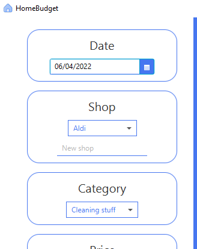

# HomeBudget
Simple app to organise your home budget.
## Table of Contents
* [General Info](#general-info)
* [Technologies Used](#technologies-used)
* [Setup](#setup)
* [First Steps](#first-steps)
* [Room for Improvement](#room-for-improvement)

## General Info
 At the beginning it was a university project, but I thought that I could develop this project and learn more new things because I'd like to be a Java Developer.
 With this program, you will manage your household expenses. At this moment you can add purchases and incomes but in future you will be able to add
the status of the gas, water or electricity meters and check useful charts and statistics.

## Technologies Used
* Java 17
* JavaFX 17
* CSS
* SQLite 3

## Setup
**You can [download it here](https://github.com/bladeours/homeBudget/releases/tag/v0.0.1)**
 
In package is whole Java 17 so you don't have to worry about installing right version of Java. All you have to do it unzip downloaded file and run `homeBudget.exe`
 
At this moment there is only version for Windows but in the near future I'll add Linux support.

## First steps
**Remove sample data:**
 
* click big checkbox in the header of Purchases or Incomes Table
* go to purchases/incomes menu
* click remove purchase/income

**Add new shop**
 
* Just write name of the new shop in "New shop" text-field, this text-field has bigger priority than list with shops. 
 

## Room for Improvement
**To do:**
* add more statistics
* add status of gas, water and electricity maters
* add exporting to CSV 
* add possibility to change currency
* add support for different years

